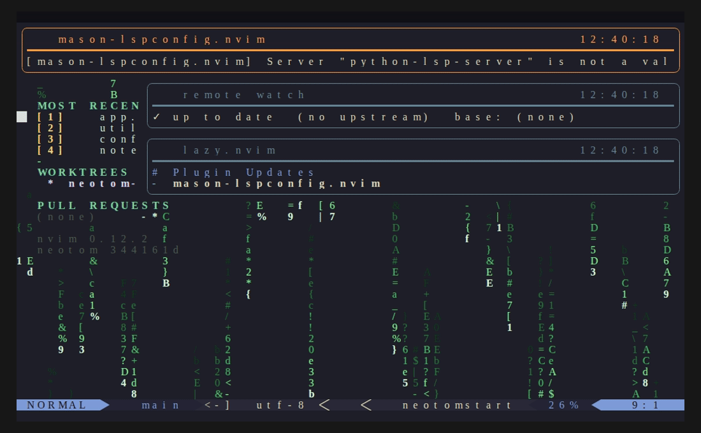

# neotom

Personal Neovim configuration. Uses native LSP and `lazy.nvim` for plugin management.



> Re-record the demo with [`recording/record.sh`](recording/README.md).

## Architecture

| Area | Path |
|------|------|
| Options | `lua/neotom/options.lua` |
| Keymaps | `lua/neotom/remap.lua` |
| Autocommands + LSP attach | `lua/neotom/autocommands.lua` |
| Start screen | `lua/neotom/startscreen.lua` |
| Remote watch | `lua/neotom/remote_watch.lua` |
| Telescope pickers | `lua/neotom/telescope/` |
| Plugin specs | `lua/plugins/` |
| Snippets | `lua/snippets/` |
| Filetype overrides | `after/ftplugin/` |
| Work module (PHP) | `lua/mhvdc/` |

## Custom Features

### Start Screen
`lua/neotom/startscreen.lua`

Animated matrix rain with NEOTOM wordmark reveal. Auto-opens on empty startup; `<leader>a` to open manually.

Overlays: MRU files, git worktrees, open PRs (GitHub/GitLab), nvim version + config git hash.

| Key | Action |
|-----|--------|
| `1-9` | Open MRU file |
| `<CR>` | Follow action under cursor |
| `r` | Re-fetch PRs |
| `q` / `<Esc>` | Close |

### Remote Watch
`lua/neotom/remote_watch.lua`

Background poller (60s) that detects upstream and base branch changes. Notifies with commit log snippet and clickable URLs. Auto-starts on config load; resets on `DirChanged`.

### Telescope: Multigrep
`lua/neotom/telescope/multigrep.lua` — `<leader>g`

Live grep with inline file glob filtering. Syntax: `<pattern>  <glob>` (two spaces between).

### Telescope: CWD Picker
`lua/neotom/telescope/cwd.lua`

- `<leader>c` — find files, toggle root vs buffer dir with `Alt+D`
- `<leader>C` — grep with same toggle

Auto-detects project root via `.git`, `package.json`, `pyproject.toml`, etc.

### Telescope: GitLab MR Picker
`lua/neotom/telescope/gitlab_mrs.lua` — `<leader>mr`

Browse open MRs with comment/vote counts. Preview shows live activity feed. `Enter` opens URL, `<C-y>` yanks it. Requires `glab` CLI.

## Keymaps

Leader = `<Space>`. Arrow keys disabled.

### Normal mode

| Key | Action |
|-----|--------|
| `<leader>f` | Find files |
| `<leader>g` | Live multi-grep (`pattern  glob`) |
| `<leader>c` / `<leader>C` | Find files / grep with cwd toggle |
| `<leader>b` | Buffer picker |
| `<leader>N` | Nvim config files |
| `<leader>mr` | GitLab MR picker |
| `<leader>e` or `-` | Oil.nvim file browser |
| `<leader>tg` | LazyGit |
| `<leader>ca` | Code action |
| `<leader>cr` | Rename symbol |
| `<leader>a` | Start screen |
| `<leader>rr` | Reload config |
| `<S-l>` / `<S-h>` | Next / prev buffer |
| `<C-w>c` | Close buffer |
| `<C-w>a` | Close all other buffers |
| `<C-w>f` | Yank file path |
| `gd` | Go to definition |
| `K` | Hover docs |
| `gr` | Go to references |
| `]d` / `[d` | Next / prev diagnostic |

### Insert mode

| Key | Action |
|-----|--------|
| `jk` | Exit insert mode |
| `;;` | Jump to end of line |

### Visual mode

| Key | Action |
|-----|--------|
| `<` / `>` | Indent / dedent, maintain selection |
| `p` | Paste without overwriting register |

## LSP & Formatters

Servers managed via `:Mason`. See `lua/plugins/lsp.lua` for the full list.

Formatters via conform.nvim: `prettierd` (JS/TS/HTML/CSS/JSON/YAML/Markdown/GraphQL), `shfmt` (shell), `black` (Python). Format on save enabled.

Treesitter highlighting auto-enabled for all filetypes. Parsers managed via `lua/plugins/treesitter.lua`. Tracks `nvim-treesitter` main branch.

## Plugin Management

- `:Lazy` — install/update plugins
- `:Mason` — install/update LSP servers and formatters
- `:TSInstall <lang>` — install treesitter parser for a language

## Docker

```bash
docker build --build-arg TAG=nightly -t neotom .
docker run -it neotom nvim
```

## Upgrading Neovim

Use the `rebuild-nvim` script — handles purging state, checking out the version, compiling a release build, and installing.

To purge manually without rebuilding:

```bash
rm -rf ~/.local/share/nvim ~/.local/state/nvim ~/.cache/nvim
sudo rm -rf /usr/local/share/nvim/runtime
```
